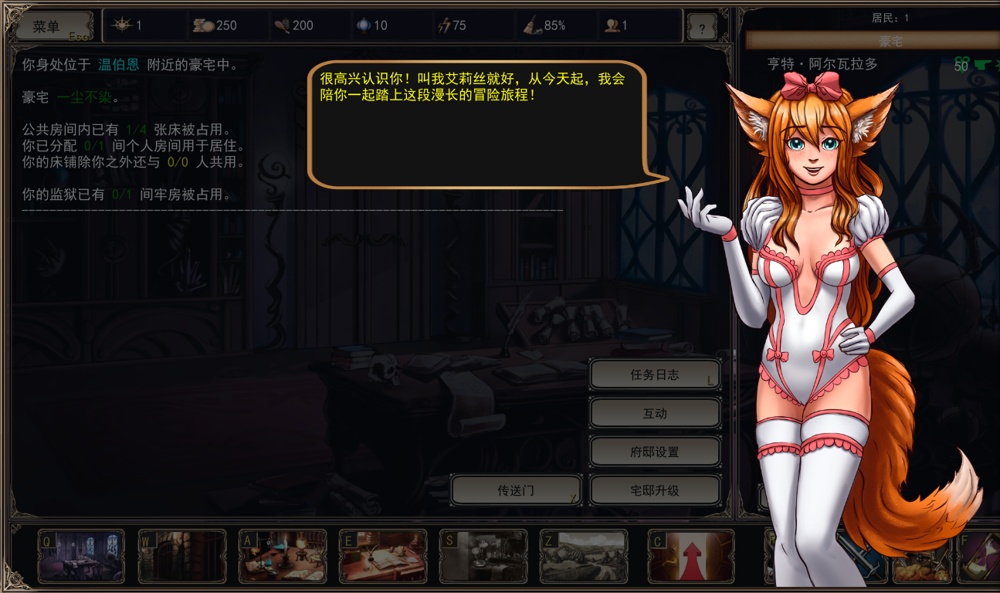

运行时文本翻译桥。当前版本面向 `Strive for Power 1.0d` 的界面中文化，默认翻译到简体中文。

# 适配目标

- 游戏：`Strive for Power 1.0d` Windows 64 位公开版
- 模组目录：`RuntimeLocaleBridge`
- 游戏内识别：mod 列表会按目录名显示，所以发布时请保持这个目录名
- 翻译范围：运行时可见的 UI 文本，包括 `Label`、`BaseButton`、`RichTextLabel`、`LineEdit` 提示、`hint_tooltip`、`window_title`、`dialog_text`，以及 `MenuButton`、`OptionButton`、`PopupMenu`、`ItemList`、`TabContainer` 的条目

# 基本功能

- 扫描当前界面中可见的文本组件
- 自动替换字体，尽量保证中文可正常显示
- 本地缓存翻译结果，避免重复请求
- 对 BBCode 先罩住标签和占位符，再翻译后还原
- 翻译后端使用 DeepSeek Chat Completions
- 支持自定义 API 地址、模型、`max_tokens` 和 `temperature`

# 使用方法

1. 将整个项目 clone 到模组文件夹 `mods` 之下，你可以在游戏内的模组设置中找到这个位置
2. 启动游戏并启用该 mod
3. 打开游戏内 `Options -> Settings`
4. 填写 `DeepSeek API Key`
5. 返回游戏或重启一次，让运行时扫描重新生效

# 配置文件

- `cache/translations.json`：翻译缓存，后续会自动复用

# 说明

- 首次运行需要时间建立缓存，后续会明显更快
- 该 mod 只处理界面上实际显示出来的文本，不处理图片里的文字
- 如果游戏更新后 UI 结构变化，可能需要同步调整扫描规则
- 当前后端配置是中文翻译流程，但整体结构可以很容易更改翻译目标为其他语言

# 更改翻译目标为其他语言

本项目默认使用简体中文翻译。如果要改成其他语言，需要修改翻译脚本中的目标 locale 和 DeepSeek 的系统提示，并清空旧缓存。

1. 编辑 `patch/files/scripts/mods/chinese_runtime_cn_translator.gd`
  1. 找到 `_ready()` 中的两行：
	```gdscript
	translation_resource.locale = "zh_CN"
	TranslationServer.set_locale("zh_CN")
	```
	将 `zh_CN` 改成目标语言对应的 Godot locale，例如：
	- 西班牙语：`"es"`
	- 法语：`"fr"`
	- 日语：`"ja"`
	- 韩语：`"ko"`
	- 俄语：`"ru"`
  2. 找到 `_system_prompt()`，将提示改成目标语言，例如：
	```gdscript
	return "你是游戏文本翻译器。把用户给出的英文 UI 文本翻译为日文。只返回译文，不要解释。保持换行、数字、标点和占位符不变；形如 __CNUI_D_0__、__CNUI_B_0__ 的占位符必须原样保留。"
	```
2. 删除 `cache/translations.json` 或将其翻译为目标语言，这是加速翻译的翻译缓存。
3. 若目标语言包含非英文字符，则可能需要替换字体文件 `BLKCHCRY.TTF` 和 `Roundo-Medium.otf` 以避免可能的字符缺失（不要改字体文件名）。
4. 正常安装和使用Mod
